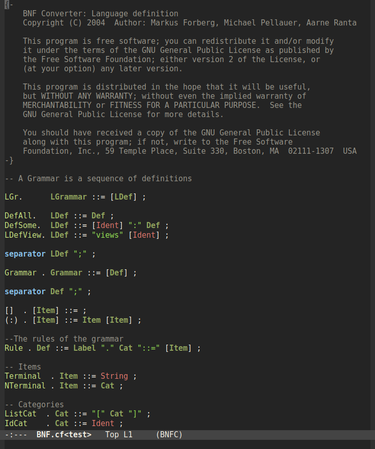

# bnfc-mode

bnfc-mode simplifies editing [BNFC](http://bnfc.digitalgrammars.com/) input
files in Emacs. BNFC is a handy tool for converting context-free grammars into
parsers, syntax highlighters, and documentation.

Input files are in a language called *Labelled BNF*. As a context-free grammar,
it's capable of
[describing itself](https://github.com/BNFC/bnfc/blob/master/source/src/BNF.cf).
Here's a screenshot of part of that grammar in bnfc-mode.

## Features

* Syntax highlighting via `font-lock-mode`
* Automatically loads on files with `*.cf` extension
* Comment/uncomment lines using `M-;`

## Installation

The recommended way is via [MELPA](https://melpa.org/), but it can also be
installed manually.

## License

This program is free software; you can redistribute it and/or modify it under
the terms of the GNU General Public License as published by the Free Software
Foundation; either version 2 of the License, or (at your option) any later
version.

This program is distributed in the hope that it will be useful, but WITHOUT ANY
WARRANTY; without even the implied warranty of MERCHANTABILITY or FITNESS FOR A
PARTICULAR PURPOSE. See the GNU General Public License for more details.

You should have received a copy of the GNU General Public License along with
this program; if not, write to the Free Software Foundation, Inc., 51 Franklin
Street, Fifth Floor, Boston, MA 02110-1301, USA.
